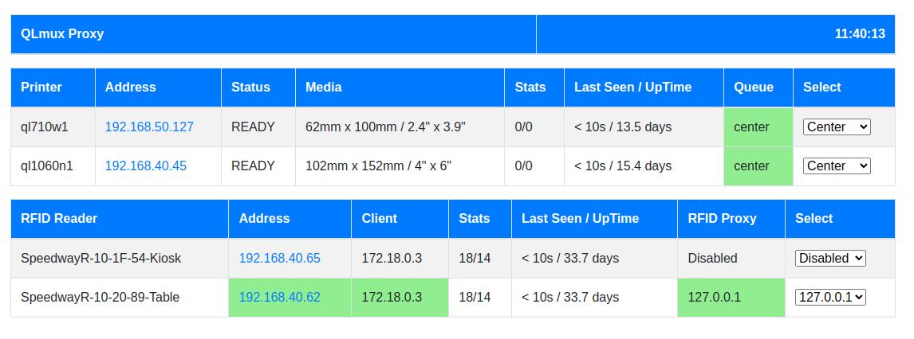

# QLMux Proxy

## Overview

QLMux Proxy is a robust solution designed to streamline label printing for events using Brother QL printers and dynamically manage RFID readers. It supports pools of Brother QL printers to enhance throughput and redundancy and acts as a proxy for RaceDB to connect with dynamically discovered RFID readers.

### Features
- **SNMP Broadcast Discovery**: Automatically finds Brother QL Label printers and Impinj RFID readers on the network.
- **Dynamic Device Management**: Simplifies setup and use of printers and RFID readers, allowing for easy swapping without reconfiguring RaceDB.
- **Web Status Page**: Provides diagnostics and control for printers and RFID readers, accessible via a simple web interface.

### Additional Scripts
- **qllabels**: Converts a label PDF file to Brother QL raster format and submits it to QLMux Proxy.
- **rfidproxy**: Connects RaceDB to the QLMux Proxy and the RFID reader.

For more information, see the [related.md](related.md) file.

## QLMux Proxy Changes
- Eliminates the need for static configuration files.
- Utilizes SNMP Broadcast Discovery to locate devices.
- Supports proxying traffic to dynamically found RFID readers.
- Includes a web status page for monitoring and configuring device queues.

### Label Printing
QLMux Proxy supports label printing to Brother QL printers, dynamically discovering and managing them in pools to ensure efficient and redundant operation. The `qllabels` script formats labels and submits them to the QLMux Proxy based on command-line arguments from RaceDB.

### RFID Reader Proxy
QLMux Proxy transparently proxies RaceDB connections to dynamically found RFID readers, using a single IP address and port. The `rfidproxy` script connects RaceDB to the QLMux Proxy and RFID reader.

## RFID Proxy Configuration
- Any connection to QLMux Proxy on port 5084 is proxied to the found RFID reader.
- The web status page allows easy selection of which RFID reader to use.
- Supports multiple local IP addresses for different RFID readers.

### Example Configuration
- Outside a container:
  - 127.0.0.1:5084 -> 0.0.0.0:5085
  - 127.0.0.2:5084 -> 0.0.0.0:5086
  - 127.0.0.3:5084 -> 0.0.0.0:5087
- Inside a container:
  - 127.0.0.1:5084 -> 172.17.0.1:5085
  - 127.0.0.2:5084 -> 172.17.0.1:5086
  - 127.0.0.3:5084 -> 172.17.0.1:5087

## Printer Management and Spooling
QLMux Proxy periodically checks printer status using SNMP to ensure efficient and error-free printing. Printers are managed in pools to balance load and minimize delays. 

### Printer States
- **Ready**: Powered on and ready.
- **Cover Open**: The printer cover is open.
- **Not Available**: Not powered, turned off, or disconnected.
- **Error**: Reporting errors such as out of labels or jams.

### Label Sizes
QLMux Proxy supports two label sizes:
- **2"x4" (62mm x 102mm)**: For frame and shoulder labels (Brother QL-710W, QL-720NW).
- **4"x6" (102mm x 152mm)**: For bib number labels (Brother QL-1060N).

### Printer Pools
QLMux Proxy supports three pools for each label size:
- **Left**: For RFID reader ports 1 and 2.
- **Right**: For RFID reader ports 3 and 4.
- **Center**: Backup for Left and Right pools.

The web status page allows moving printers between pools to optimize for event size.

## Web Status Page
Access the web status page at http://localhost:9180/status to monitor and configure printers and RFID readers.

## Swapping Devices
QLMux Proxy automatically discovers and integrates new printers and RFID readers. Use the web status page to manage device pools and configurations for larger events.

## Network and Device Configuration
### Network Ports
- **0.0.0.0:9180**: Web Status Page
- **0.0.0.0:9101-9104**: Job submission ports for Brother QL printers
- **0.0.0.0:5085-5087**: Proxy ports for RFID readers

For container installations, use the `--network=host` option to enable SNMP broadcast discovery.

### Device Requirements
- **Brother QL Printers**: Must be on the same network, use DHCP, and have unique hostnames.
- **Impinj RFID Readers**: Must be on the same network, use DHCP, and have unique hostnames.

## Installation
Refer to the Makefile for installation instructions.

### Container Installation
QLMux Proxy can run as a container. Refer to the [docker](docker/docker.md) file for build and run examples.

## Related Projects
- **traefik_racedb**: Supports QLMux Proxy and Traefik containers for existing RaceDB installations ([GitHub](https://github.com/stuartlynne/traefik_racedb)).
- **racedb_qlmux**: Complete set of containers for Postgresql, RaceDB, QLMux Proxy, and Traefik ([GitHub](https://github.com/stuartlynne/racedb_qlmux)).

For further details, see the [related.md](related.md) file.
