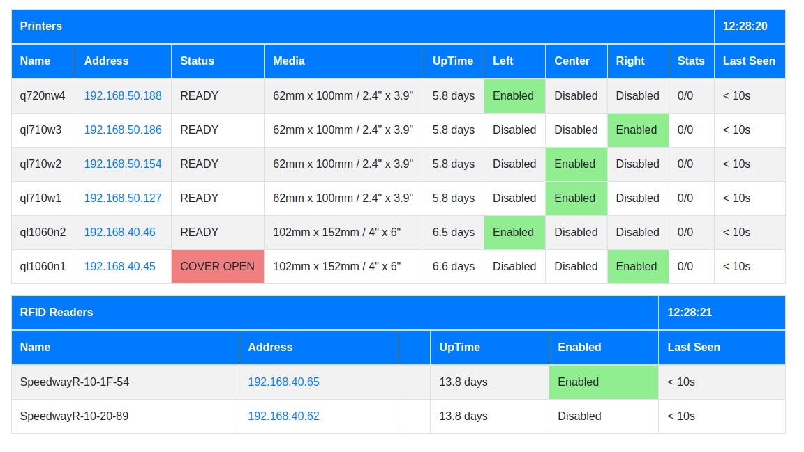

# QLMux Proxy
## Copyright (c) 2018-2024, stuart.lynne@gmail.com
## Thu May  2 05:01:13 PM PDT 2024

## Overview
This is the new version of *QLMuxd* that is designed to support label printing to 
Brother QL printers that are set up in pools to allow for increased throughput and redundancy
and act as a proxy for RaceDB to use a dynamically found RFID reader.

This version uses SNMP broadcast discovery to find *Brother QL Label printers* and 
*Impinj RFID readers* on the network. 

The goal is to:
- simplify the setup and use of the QL printers and RFID readers for during events using RaceDB.
- allow for easy swapping of printers and RFID readers without changing the RaceDB configuration.
- better diagnostics and control of the printers and RFID readers using a simple Web Status page.

## QLMux
QLMux Proxy changes:

- no static configuration files
- use of SNMP Broadcast Discovery to find Brother label printers and Impinj RFID readers
- support for proxying traffic from to a found RFID router
- a web status page to monitor printer and RFID readers and effect some configuration for printer queues

*QLMux Proxy* was designed to support label printing to Brother QL printers that are set up in pools to allow for increased throughput 
and redundancy. The new version finds the printers dynamically using SNMP broadcast discovery. By default the printers are 
placed into a single pool, which is suitable for small events. For larger events, the printers can be placed into two different
pools to allow for increased throughput and redundancy using the builtin Web Status page.

*QLMux Proxy* also implements a transparent proxy for RaceDB to use a dynamically found RFID reader. This allows *RaceDB*
to use a single *IP address* and *port* to connect to the RFID reader. The *QLMux Proxy* will then forward the connection to the
correct RFID reader that is dynamically found. By default if only one RFID reader is found, it will be used. If more than one
RFD reader is found, the first one found will be used, but this may be changed using the builtin Web Status page.

The status of each printer is monitored so that fall over can be used to do the following:

  1. Level load across the printers
  2. Ensure that printers that are not available or not working are not used
  3. Minimize printing delays
  4. Ensure that all labels are printed, duplicates are allowed.
  5. Ensure that the proper media is loaded for each printer.

Depending on the printer status, when data has arrived and is in the DataQueue, QLMux will attempt
to deliver to the first available printer in the associated Pool. 

QLMux uses SNMP to periodically check the current printer status for all specified printers. Printers that are
not in the ready state will not be used. Brother QL printers typically have four states:

  1. Ready - powered, turned on,
  2. Cover Open - the printer is reporting that it's cover is open
  3. Not available
    1. not powered,
    2. not turned on,
    3. not connected to the network.
  4. Error - the printer is reporting an error, typically one of
    1. Out of labels
    2. Labels are jammed
    3. Cut bar is jammed
    4. Wrong labels are loaded for the print job

For each printer QLMux checks that the printer at the specified host address is the correct model.

## Label Sizes

*qmux_proxy* supports two sizes of labels:

| Size | Use | Printer |
| 2"x4" (62mm x 102mm)  | frame, shoulder labels | Brother QL-710W, QL-720NW |
| 4"x6" (102mm x 152mm) | bib number labels | Brother QL-1060N |

## Pools
*qlmux_proxy* supports three pools for each of the two sizes of labels.

| Pool | Use |
| -- | -- |
| Left | for RFID reader ports 1 and 2 |
| Right | for RFID reader ports 3 and 4 |
| Center | backup for Left and Right pools|

If there are no printers available in:
- the Left or Right pool, the Center pool will be used. 
- the Center pool, the first available printer will be used from any pool.

By default the printers are placed in the Left pool. The Web Status page can be used to move printers between pools.

For small events (1-2 registration stations) a single pool is sufficient. For larger events (3-4 registration stations) 
configuring multiple pools can reduce the time to print labels and help people find their bib numbers faster.

## RFID Readers

*qlmux_proxy* supports a proxying a connection from RaceDB to an Impinj RFID reader. 

Any connection to the *qlmux_proxy* on port 5084 will be proxied to the RFID reader found via SNMP Broadcast.

To allow for easy swapping of RFID readers, *qlmux_proxy* can support selection of which RFID reader to use via the 
built-in web status page.

## Web Status Page

The Web Status page is available at http://localhost:9180/status. It shows the status of the printers and RFID readers

## Swapping Printers

The *QLMux Proxy* will automatically find the printers on the network and add them to the printer pool. If a printer is
swapped out, the *QLMux Proxy* will automatically find the new printer and add it to the pool. The problem printer can
be left in place, just open the cover to stop it from being used.

For larger events, it may be necessary to have two pools of printers, and in this case the Web Status page will be used 
to put the new printer in the correct pool.

## Swapping RFID Readers

The *QLMux Proxy* will automatically find the RFID readers on the network and add them to the list of available RFID readers.

Best practice is to have only one RFID reader on the network at a time. If more than one RFID reader is found, the first one
will be used. If the RFID reader is swapped out, the *QLMux Proxy* will automatically find the new RFID reader and start using it.

Having the backup RFID reader powered on and not connected will make switching faster.

## Network and Device Configuration

## Network Ports

- 9180 - Web Status Page
- 9101-9104 - Job submission ports for the Brother QL printers
- 5084 - Proxy port for the RFID reader

### WiFi Router

Our recommendation is to use an WiFi router that supports DHCP and provides a builtin Ethernet switch. 

### LTE Router

If need to connect to the Internet, get an LTE/WiFi router that supports DHCP and provides a builtin Ethernet switch.

Trying to connect one or more stations to the Internet using a phone as a hotspot is not recommended. It can be made to
work but often the underlying network routing is not correct and the connection is not reliable. Your mileage may vary.

### Brother QL Printers
- For WiFi printers must have the WiFi SSID and password set 
- Must be on the same network as the QLMux Proxy.
- Should use DHCP to get an IP address.
- Must have a unique hostname
- Must have raster printing enabled

### Impinj RFID Readers
- Must be on the same network as the QLMux Proxy.
- Should use DHCP to get an IP address.
- Should have a unique hostname

## Installation

See the Makefile.

## Installation as a Container

The *qlmux_proxy* can be run as a container.

See [docker](docker/docker.md) for a simple build and run example.

### traefik\_racedb
  - support qlmux_proxy and traefik containers to support existing RaceDB installation
  - [https://github.com/stuartlynne/traefik_racedb](https://github.com/stuartlynne/traefik_racedb)

### racedb\_qlmux
  - complete set of containers to implement Postgresql, RaceDB, QLMux Proxy, and Traefik
  - [https://github.com/stuartlynne/racedb_qlmux](https://github.com/stuartlynne/racedb_qlmux)

N.b. A qlmux_proxy container needs to have networking set to Host mode to allow for SNMP broadcast discovery.

## [Related Projects](related.md)

